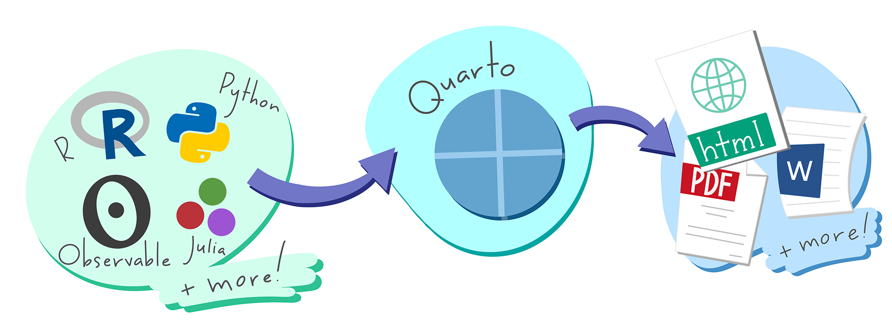
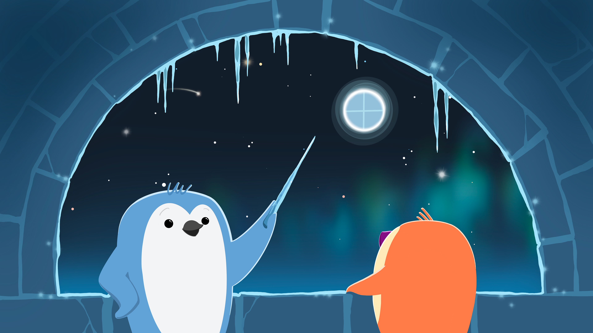

#### Attributions {.appendix}

Artwork from ["Hello, Quarto"](https://mine.quarto.pub/hello-quarto/) keynote by [Mine Çetinkaya-Rundel](https://mine-cr.com/) and [Julia Stewart Lowndes](https://jules32.github.io/), presented at RStudio Conference 2022. Illustrated by [Allison Horst](https://allisonhorst.com).

For more from Allison, see her [website](https://allisonhorst.com) and [GitHub](https://github.com/allisonhorst).
