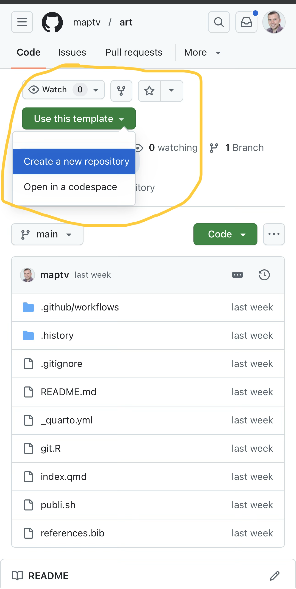
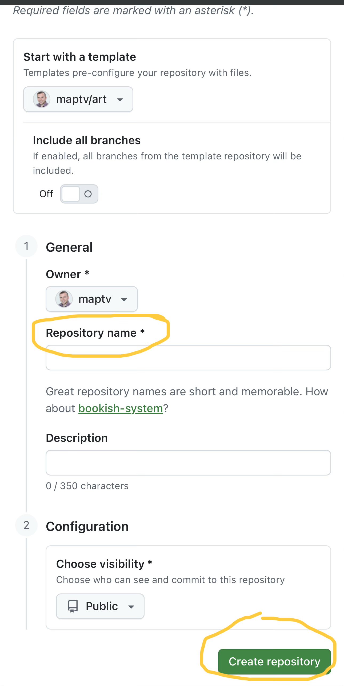
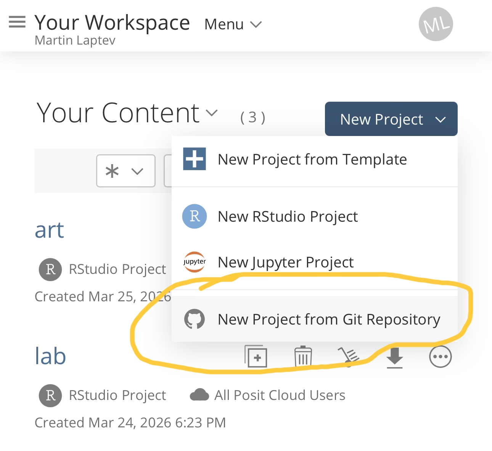

For over a decade, I have been promoting the idea that software development skills can be useful for everyone --- not just software engineers. With recent advances in artificial intelligence, software development is no longer solely the domain of highly trained engineers.

One of the best ways to get started crafting software is to create your own website.

The tools I used to create websites have improved greatly over time and as a result I would port my personal website to a new system every few years.

After a few years of building websites with Quarto, I am certain that I will not have to switch to another system ever again.

The best way to learn about Quarto is to read the [official documentation](https://quarto.org/docs/guide), but the fastest way to get started with Quarto is to use a GitHub [template repository](https://docs.github.com/en/repositories/creating-and-managing-repositories/creating-a-repository-from-a-template#about-repository-templates) (template repo) that already has everything you need.

I created a template repo for each of the three main kinds of Quarto websites:

-   Manuscript: <https://github.com/maptv/art>
-   Book: <https://github.com/maptv/book>
-   Blog: <https://github.com/maptv/USERNAME.github.io>

You can see examples of [manuscripts](https://quarto.org/docs/gallery/#articles-reports), [books](https://quarto.org/docs/gallery/#books), and [blogs](https://quarto.org/docs/gallery/#websites) in the [Quarto Gallery](http://quarto.org/docs/gallery).

I consider manuscript websites to be the simplest of the three, because the final product can consist of a single webpage, as shown by the [example](https://quarto-ext.github.io/manuscript-template-jupyter) in the documentation.

In contrast, the expectation is that there will be multiple chapters in a book and multiple posts in a weblog (blog).

The common thread across all of these types of websites is that the content of each webpage is stored in at least one Quarto markdown (qmd) file.

Therefore, a Quarto manuscript website can store all of its content in a single qmd file, whereas Quarto books and blogs are designed to have multiple qmd files.

Between books and blogs, I consider books to be simpler, because all of the chapters in a book can be stored together in the top level directory (root), whereas the default structure of a Quarto blog includes a `posts` directory that contains a subdirectory for each post.

Regardless of what you want to build with Quarto, you may want to follow the steps below to create a Quarto manuscript so that you can get familiar with the steps needed to publish and update a Quarto website before tackling the greater complexity of a book or a blog.

After you feel comfortable with a Quarto manuscript, try to repeat the steps below with my book template repo: <https://github.com/maptv/book>.

The steps below should also work for my blog template repo: <https://github.com/maptv/USERNAME.github.io>, but I prepared separate [blog setup instructions](/posts/presentation) which also explain

-   why the template repository is called `USERNAME.github.io` and
-   how to embed a Quarto presentation into a webpage like a Quarto blog post.

# Setup

0.  Go to the [manuscript](https://github.com/maptv/art) or [book](https://github.com/maptv/book) template repo I prepared

1.  Click “Use this template” and then “Create new repository”

{width="290"}

2.  Enter a repository name and click “Create repository”

{width="290"}

3.  Copy the web address (url)

4.  Go to https://posit.cloud

5.  Click “New Project” and then “New Project from Git Repository”

{width="290"}

6.  Paste the repo url you copied in Step 3 and click “OK”
7.  In the Files tab of the bottom right pane, select git.R
8.  Edit the user.name and user.email values in git.R and click the diskette icon to save
9.  When you see a yellow banner above git.R, click "Install" and wait for installation to complete in the background
10. Click “Source” in the upper right corner of the upper left pane (the one that is displaying git.R)
11. If you already have a Personal Access Token (PAT), close the new browser tab that opened. Otherwise, enter a note, click “Generate Token”, and click the copy button.

# Updating

12. Make at least one change to at least one file, such as the edits to git.R above
13. Click the "Git" tab in the top right pane of Posit Cloud
14. Click the check box next to the file you changed
15. Click "Commit" to open a popup window (modal)
16. Enter a commit message in the upper right corner of the modal and click "Commit"
17. Close all modals and click the green up arrow labeled "Push" to push your commit to GitHub

# Publishing

18. Push at least one commit to your repo using the instructions above so that the credentials manager has your username and PAT
19. Copy the command below, paste it into the terminal tab in the lower left pane, and press Enter or Return

``` sh
quarto publish gh-pages
```

If all goes according to plan, you will never again need to run `quarto publish gh-pages` again for this repo because — thanks to `.github/workflows/publish.yml` — your site will be built and published whenever you update your site by pushing at least one commit to your repo using the "Updating" instructions above.
