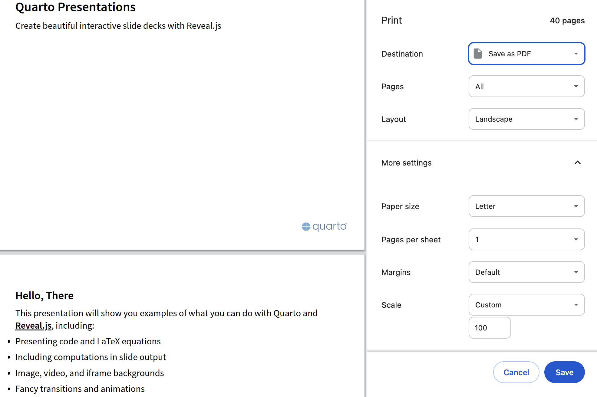
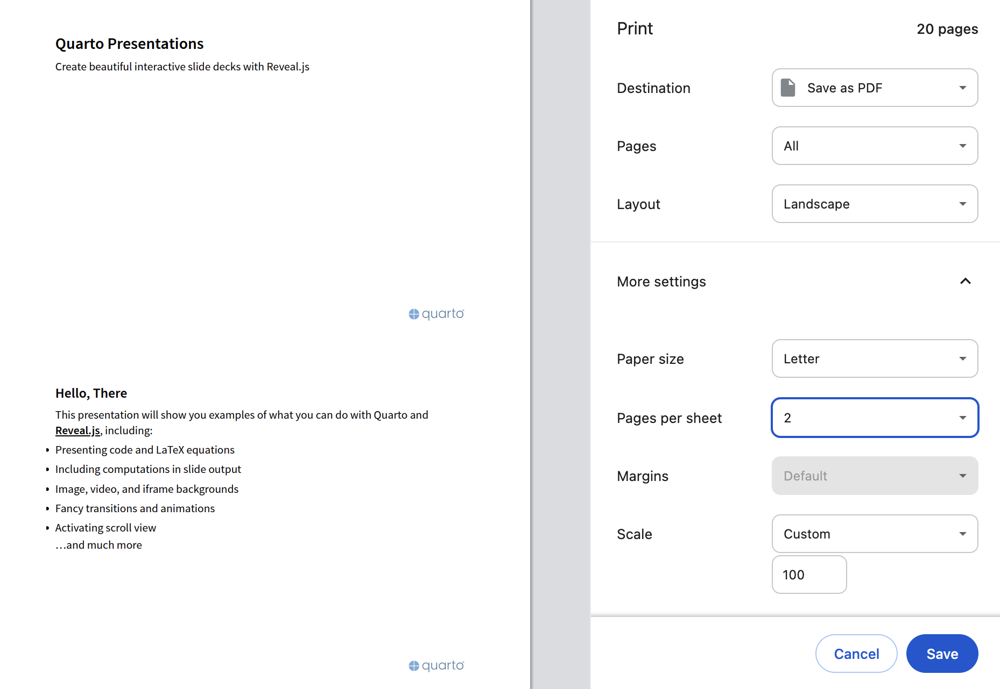

With Quarto, you can turn Quarto markdown (qmd) files into documents like articles or reports, websites such as blogs, and different kinds of presentations including sales pitches.

Like other digital deliverables created by Quarto, presentations can be rendered as HTML, viewed in a web browser, and saved as a PDF using the print dialog.

Before saving, we should make sure the Layout is set to Landscape.

{style="border-color: gray;border-style: solid;"}

A PDF presentation should have only one slide per page, but putting multiple slides on one page may be convenient if we want to read the slides instead of presenting them.



For best results, I suggest following the PDF export instructions in the [RevealJS](https://revealjs.com) documentation: <https://revealjs.com/pdf-export/>.

PDF files are ubiquitous and it is good to know that you can generate one with nothing more than a web browser whenever necessary, but HTML files can do many things that PDF files simply cannot.

The HTML presentation below demonstrates all of the features described in its slides, many of which are not active in the PDF presentation beneath it.

<div>

```{=html}
<iframe class="slide-deck" src="demo/" width="100%"></iframe>
```

</div>

<div>

```{=html}
<iframe class="slide-deck" src="demo/demo.pdf" width="100%"></iframe>
```

</div>

Instead of embedding your presentation in a webpage as shown above, you can view it in its own browser tab in [HTML](demo/) or [PDF](demo/demo.pdf) format.
